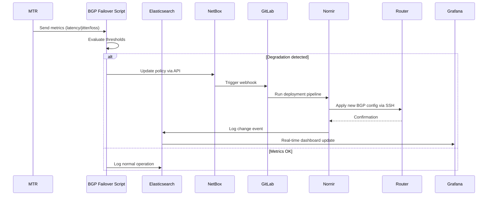

# 🚀 Containerlab Laboratory: BGP Routing Policies Automation & Telemetry

> A simulated ISP network environment with automated BGP policy failover based on real-time link quality metrics.

---

## 📋 Summary

This laboratory simulates an Internet Service Provider (ISP) network environment with two WAN uplinks (**Provider1** and **Provider2**). It deploys:

- 🔧 An **Automation Framework** for dynamic BGP routing policy updates
- 📊 A **Telemetry Stack** for real-time observability of link quality with upstream providers

✅ **Key Benefit**: The proposed solution enables **automatic BGP routing policy failover** driven by network quality metrics (latency, jitter, packet loss).

---

## 🏗️ Proposed Solution Architecture

### 🤖 Automation Framework

| Component | Role | Key Features |
|-----------|------|-------------|
| **NetBox** | Single Source of Truth (SSoT) | • BGP policy modeling with custom fields<br>• RESTful API for external integrations<br>• Webhooks to trigger automation events<br>🔗 [netboxlabs.com](https://netboxlabs.com/) |
| **GitLab CI/CD** | Configuration Pipeline | • Automated pipeline for BGP policy changes<br>• GitLab Runner as configuration deployment executor<br>🔗 [gitlab.com](https://gitlab.com/) |
| **Nornir** | Automation Orchestrator | • Multi-vendor, multi-platform task orchestration<br>• Integrated with GitLab Runner for secure access to Huawei core routers<br>🔗 [nornir.readthedocs.io](https://nornir.readthedocs.io/en/latest/#) |

---

## 🔄 Architecture Diagram


## 📡 Telemetry Stack

| Component | Role | Key Features |
|-----------|------|-------------|
| **MTR (Matt's Traceroute)** | Link Quality Diagnostics | • Real-time monitoring of latency, jitter, and packet loss<br>• BGP peer path analysis<br>• Integrated with BGP Failover Script for automated decision-making<br>🔗 [github.com/traviscross/mtr](https://github.com/traviscross/mtr) |
| **Elasticsearch** | Telemetry Data Backend | • Automatic indexing and storage of telemetry events<br>• High-performance search and aggregation for time-series metrics<br>• Receives data from BGP Failover Script via HTTP/REST<br>🔗 [elastic.co/elasticsearch](https://www.elastic.co/es/elasticsearch) |
| **Grafana** | Visualization & Dashboards | • Dynamic panels for BGP peer latency metrics<br>• Real-time link change tracking and alerting<br>• Elasticsearch as native datasource for powerful queries<br>🔗 [grafana.com](https://grafana.com/) |

---

## 🗺️ Laboratory Architecture


> 📌 *Replace `./images/topology-diagram.png` with the actual path to your topology image. Recommended size: 1200x800px for optimal rendering.*

### 🔍 Architecture Highlights:
- **Dual WAN Uplinks**: Provider1 & Provider2 with independent BGP sessions
- **Core Router**: Huawei device managed via SSH through Nornir
- **Automation Plane**: NetBox → GitLab CI/CD → Nornir → Router
- **Telemetry Plane**: MTR → BGP Failover Script → Elasticsearch → Grafana

---

## 🔄 BGP Failover Workflow


> 📌 *Replace `./images/bgp-failover-workflow.png` with the actual path to your workflow image.*

### Workflow Steps:
1. 📊 **Monitor**: MTR continuously probes BGP peers for latency, jitter, and packet loss
2. ⚙️ **Evaluate**: BGP Failover Script analyzes metrics against defined thresholds
3. 🎯 **Decision**: If degradation detected → trigger policy update via webhook
4. 🚀 **Execute**: GitLab CI/CD pipeline activates → Nornir pushes new config to Huawei router
5. ✅ **Validate**: Post-change verification + telemetry update in Elasticsearch
6. 📈 **Visualize**: Grafana dashboard reflects new active provider and link status


## ⚙️ Automation Framework Configuration (Detailed)

### 1. NetBox Node

- Install NetBox container following:
  https://github.com/netbox-community/netbox-docker/wiki/Using-Netbox-Plugins

- Install BGP plugin:
  https://github.com/netbox-community/netbox-bgp.git

- Deploy NetBox:
```bash
docker compose up -d
```
- Generate a secure API token
- Configure core objects:
  - Sites
  - Platforms
  - Manufacturers
  - Devices
  - Interfaces
- Configure BGP objects:
  - Communities
  - Prefix List Rules
  - Routing Policy Rules
  - Sessions
- Define custom fields:
  - local_asn
  - as_path_prepend_count
  - local_preference
- Connect NetBox to Containerlab topology:
```bash
docker network connect isp-bgp netbox-docker-netbox-1
```
### 2. GitLab CI/CD (Secure Automation Pipeline)
- Create a GitLab repository
- Configure .gitlab-ci.yml:
  - Stages: deploy
  - Variables: NetBox URL, NetBox Token
  - Script: apply_bgp_policies.py
- Configure Nornir inventories:
  - defaults.yaml
  - groups.yaml
  - hosts.yaml
- Configure nornir-config.yml:
  - Inventory paths
  - Connection options
- Implement Python automation script:
  - apply_bgp_policies.py
- Example configuration files available at: /configs/nornir/automation
- Create Pipeline Trigger Token (for secure pipeline execution via NetBox webhooks)
- Create Project Runner (required for automation job execution):
  - Tags: nornir, production
### 3. Nornir Node
- Register GitLab Runner in nornir node:
```bash
gitlab-runner register \
  --url "https://gitlab.com/" \
  --registration-token "YOUR_PROJECT_RUNNER_TOKEN" \
  --description "Nornir Production Runner" \
  --tag-list "nornir, production" \
  --executor "shell"
```
## 📡 BGP Failover Script Functionality
### Monitoring Tool
- MTR (My Traceroute)
- Protocol: IPv4 / IPv6
- Output format: JSON (for automated parsing)
### 📏 Measurements and Scoring
- Measurement Points
  - BGP Peer → Direct latency to router
  - Public DNS → Hop-by-hop latency
### Collected Metrics
| Metric | value | 
|-----------|------|
| Average Latency | (ms) | 
| Jitter / Variability | (Standard Deviation) | 
| Packet Loss | (%) |
### Measurement Parameters
| Parameter | value | 
|-----------|------|
| Cycle interval | 30 seconds | 
| Packets per cycle | 5 | 
| Packet size | 64 bytes |
| Packet interval | 0.5 seconds |
| Timeout | 30 seconds |
### 🧮 Weighted Scoring System
- Score = Weighted_Latency + Loss_Penalty + Jitter_Penalty. Where...
  - Weighted_Latency = (Peer × 70%) + (DNS × 30%)
  - Loss_Penalty = (Peer_Loss% + DNS_Loss%) × 100
  - Jitter_Penalty = (Peer_StDev + DNS_StDev) × 0.5 

